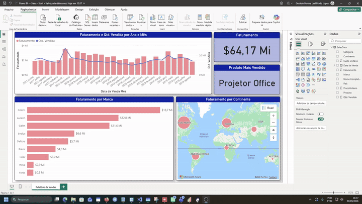
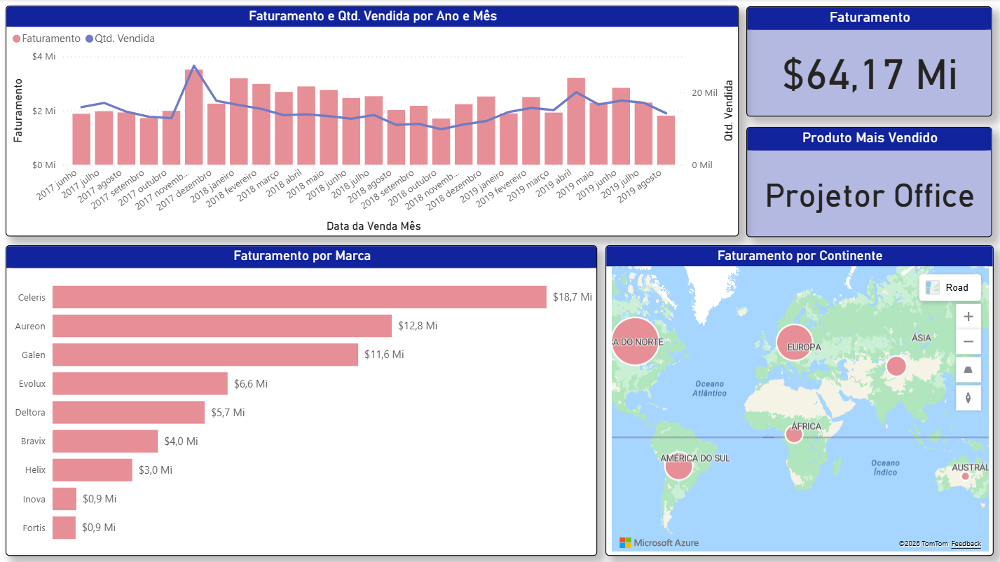

# Dashboard de Vendas | Power BI

Dashboard interativo desenvolvido em Power BI para acompanhar o desempenho comercial por período, marca e continente. O projeto transforma uma base de vendas em indicadores visuais para apoiar a análise de faturamento e volume vendido.



## Visão geral



O painel destaca:

- evolução mensal de faturamento e quantidade vendida;
- faturamento total e produto mais vendido;
- comparação de faturamento por marca;
- distribuição geográfica do faturamento por continente.

## Tecnologias

- **Power BI Desktop** — modelagem, métricas e visualização dos dados;
- **Power Query** — importação e transformação da base;
- **Excel** — fonte de dados do projeto.

## Estrutura do repositório

```text
Power BI — Sales - Start.pbix  # Relatório final em Power BI
assets/dashboard/             # GIF de demonstração e imagem de prévia
data/raw/                     # Base de vendas em Excel
docs/curso/                   # Material de apoio e capturas da aula de referência
```

## Como explorar

1. Baixe ou clone este repositório.
2. Abra o arquivo `.pbix` no Power BI Desktop.
3. Caso seja solicitado, confirme o caminho da fonte em `data/raw/vendas.xlsx`.
4. Atualize os dados para navegar pelos visuais.

## Contexto do projeto

Projeto de estudo construído a partir da primeira aula do Intensivão de Power BI da Hashtag Treinamentos. A base foi trabalhada e o relatório foi adaptado como prática de modelagem, tratamento de dados e criação de dashboards.

O conteúdo presente em `docs/curso/` é mantido apenas como material de referência do aprendizado.

## Autor

Desenvolvido por Geraldo Humberto como parte do portfólio de Business Intelligence.
